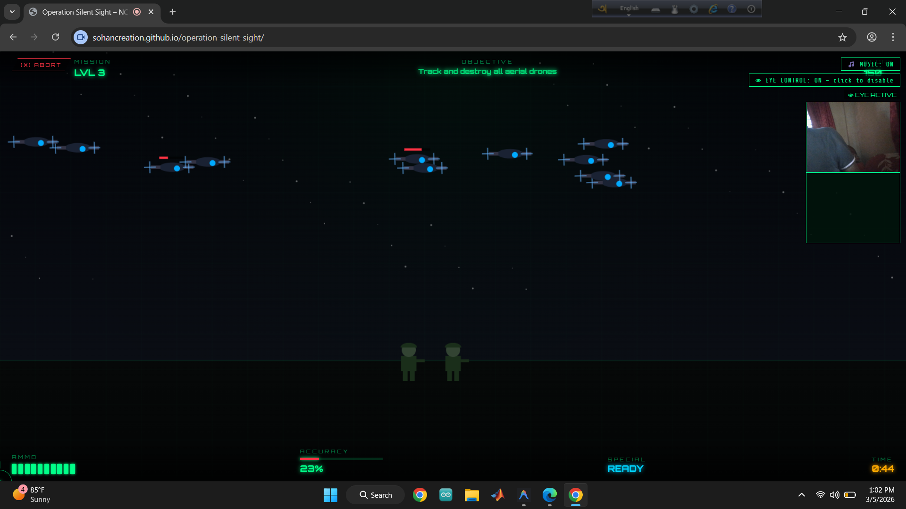

# 👁 Operation Silent Sight
### Neural Combat Interface (NCI) – Military Defense Simulator

[](#)
[](#)
[](#)

**Operation Silent Sight** is a high-stakes, web-based military simulation that leverages cutting-edge facial tracking technology to put you in the role of an elite NCI operator. Aim with your eyes, blink to engage hostiles, and defend classified perimeters in a browser-native tactical environment.

---

## 🚀 Experience the Simulation
**Deployed at:** [sohancreation.github.io/operation-silent-sight/](https://sohancreation.github.io/operation-silent-sight/)

---

## 📸 Simulation Interface (Level 3: Drone Assault)


---

## 🛠 Features

- **Neural Aiming Matrix**: High-precision cursor control mapped to facial orientation and eye movement.
- **Biometric Engagement**: Advanced blink detection logic (powered by MediaPipe) for firing and reloading.
- **Level-Based Missions**: 5 high-intensity levels ranging from training facilities to secret base breaches.
- **Tactical HUD**: Real-time accuracy tracking, ammunition pips, and mission status notifications.
- **Military Aesthetic**: CRT scanlines, thermal overlays, and a high-fidelity "classified" UI design.
- **No Extra Hardware**: Operates using a standard consumer-grade webcam—no expensive eye trackers required.

---

## 🎮 Controls

| Action | Bio-Input (Eye Tracking) | Keyboard/Mouse Backup |
| :--- | :--- | :--- |
| **Aim** | Move Head/Eyes | Move Mouse |
| **Fire** | Single Blink | Left Click |
| **Reload** | Quick Double Blink | Double Click |
| **Special Ability** | Sustained Long Blink (>600ms) | Right Click / Hold 'Q' |

---

## 💻 Technology Stack

- **Computer Vision**: [MediaPipe Face Landmarker](https://developers.google.com/mediapipe/solutions/vision/face_landmarker) for real-time 3D facial landmark detection.
- **Rendering**: HTML5 Canvas API for game logic and 60fps performance.
- **Styling**: Vanilla CSS3 utilizing CSS Variables for dynamic thermal/hit effects and scanline filters.
- **Audio**: Custom spatial sound engine for immersion.

---

## 📥 Local Setup

1. **Clone the Repository**:
   ```bash
   git clone https://github.com/sohancreation/operation-silent-sight.git
   cd operation-silent-sight
   ```

2. **Run Locally**:
   Simply open `index.html` in any modern browser (Chrome/Edge recommended for best webcam performance).
   *Note: Due to browser security, some features may require a local server.*
   ```bash
   npx serve
   ```

---

## 📜 Mission Log (Development)
- [x] Initial NCI Calibration Logic
- [x] Web-Native Face Mesh Integration
- [x] Tactile Blink detection & Smoothing
- [x] Multi-level mission progression
- [x] Dynamic HUD & UI System
- [ ] Global Leaderboard Sync (Planned)

---

## ⚖️ License
Distributed under the MIT License. See `LICENSE` for more information.

**Operator Note**: *This is a training simulation. Accuracy is paramount. Good luck, Operator.*
